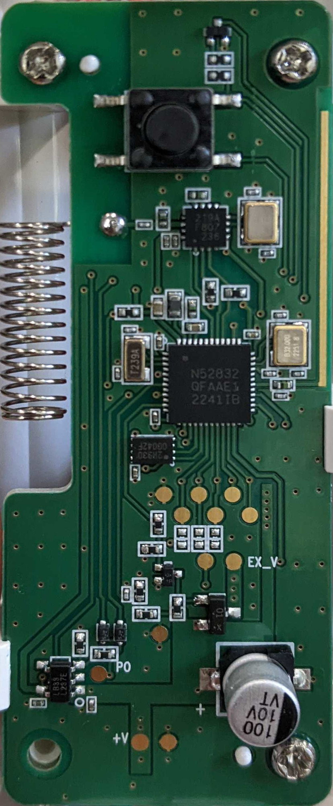
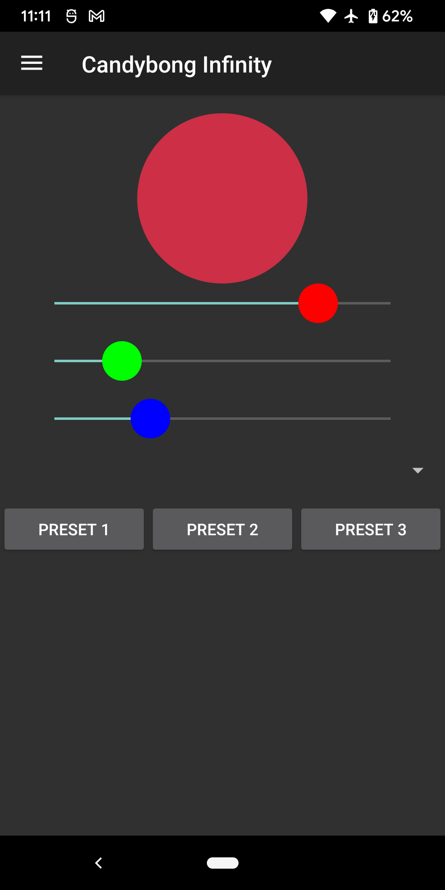

# Reverse Engineering the Twice Candybong Infinity

Unveiling the Tech Magic of the Twice Candybong Infinity! This repository is all about delving into the secrets of the Twice Candybong Infinity light stick. Have you ever wondered how it synchronizes during the concert? We're here to break it down.


## Table of Contents

1. [Hardware](#hardware)
2. [Backend API](#backend-api)
3. [Firmware](#firmware)

## Hardware

The light stick is manufactured by [cocoaent](http://app.cocoaent.com/). It is powered by the Nordic nRF52832 Bluetooth LE Microcontroller and the CMOSTEK CMT2219A Sub-GHz radio. The light stick consists of 12 RGBW addressable LEDs for the outer ring and 10 LEDs for the inner ring. The touch wheel function is managed by the Azoteq IQS722x capacitive touch controller.

FCC ID: [2BA9F-TWICEO3V](https://apps.fcc.gov/oetcf/eas/reports/ViewExhibitReport.cfm?mode=Exhibits&calledFromFrame=N&application_id=SLPljZ76k7TO33f3OxspjA%3D%3D&fcc_id=2BA9F-TWICEO3V)

### System Diagram


### Main PCB

 

### Touchwheel PCB


### GPIO config
- 3 - press button
- 15 - touch out ?
- 16 - touch in ?
- 17 - touch in ?
- 30 - SubRF CSB
- 29 - SubRF SDA
- 28 - SubRF SCL
- 26 - SubRF GPO4 - used as DOUT

## Backend API

The Candybong Infinity light stick currently lacks official app support. Only its predecessor, the CandybongZ light stick, has [official app](https://play.google.com/store/apps/details?id=com.xlab.candybongz) support. However, the CandybongZ app does not extend its support to the newer Infinity light stick. Upon examining the APK, it reveals the backend server URL.

```
public static String API = "api/v1/";
public static String MAIN_SERVER = "http://app.cocoaent.com:11000/";
public static String MAIN_SERVER_BASEAPI_URL = MAIN_SERVER + API;
```

URL: http://app.cocoaent.com:11000/ bring to "ALL LIGHT STICK Admin" login page. It used Java Spring Framework. Tried admin:admin, admin:password and no luck.

URL: http://app.cocoaent.com:11000/api/v1/ is the backend api that the light stick used. This URL return JSON list of all the possible enpoints.

e.g. 
```
{
  "_links" : {
    "factoryfirmwaresV2" : {
      "href" : "http://app.cocoaent.com:11000/api/v1/factoryfirmwaresV2{?page,size,sort}",
      "templated" : true
    },
    "FactoryFirmwareBandV1Statistics" : {
      "href" : "http://app.cocoaent.com:11000/api/v1/FactoryFirmwareBandV1Statistics{?page,size,sort}",
      "templated" : true
    },
    "version" : {
      "href" : "http://app.cocoaent.com:11000/api/v1/version{?page,size,sort}",
      "templated" : true
    },
    ....
```

### Version Endpoint

URL: http://app.cocoaent.com:11000/api/v1/version/1

returns a JSON that includes firmware versions for both the V1 and V2 light sticks, as well as the app's configuration profile. However, there is no mention of the V3 Infinity light stick in this reference.

```
{
  "created" : 1612402792390,
  "updated" : 1612402792390,
  "linkVersion" : "0",
  "title" : ".",
  "isDeployed" : 1,
  "mainSkinVersion" : "1.0",
  "memberSkinVersion" : "1.0",
  "seatFileVersion" : "2.1",
  "firmwareVersionV1" : "1.4",
  "firmwareVersionV2" : "1.4",
  "firmwareBandVersionV1" : "1.7",
  "firmwareNordicVersion" : "1.0",
  "youtubeUrl" : "https://www.youtube.com/channel/UCzgxx_DM2Dcb9Y1spb9mUJA",
  "iosAppStoreUrl" : "https://itunes.apple.com/%@/app/candybongz/id1463377397",
  "androidAppStoreUrl" : "https://play.google.com/store/apps/details?id=com.xlab.candybongz",
  "appUseQRcode" : 0,
  "appUseLightControl" : 1,
  "minimumUpdate" : 0,
  "appUseFirmwareInit" : 1,
  "qnaUrl" : "http://i-xlab.com:4000/twice",
  "lightStickControlFormat" : "{\r\n  \"kpop_groups\": [\r\n    {\r\n      \"kpop_group_name\": \"TWICE\",\r\n      \"search_name\": [\r\n        \"TWICE LIGHT STICK\",\r\n        \"TWICE OTA\",\r\n        \"Twice Band\"\r\n      ],\r\n      \ .........TRIMMED..........
  "iosOpensourceUrl" : "http://app.cocoaent.com",
  "aosOpensourceUrl" : "http://app.cocoaent.com",
  "appUsePoster" : 0,
  "posterVersion" : "1.0",
  "privacyUrl" : "http://app.cocoaent.com",
  "privacyVersion" : "1.0",
  "iosPermissionGuideUrl" : "http://app.cocoaent.com",
  "aosPermissionGuideUrl" : "http://app.cocoaent.com",
  "iosPermissionGuideVersion" : "1.0",
  "aosPermissionGuideVersion" : "1.0",
  "seatMethodType" : 0,
}
```

From the timestamp in the JSON, the configuration were created in Feb 4, 2021.

### Products Endpoint

URL: http://app.cocoaent.com:11000/api/v1/products/search/getProduct?index=1

yields distinct backend server URLs for each product.

```
{
  "index" : "1",
  "name" : "SEVENTEEN",
  "created" : 0,
  "updated" : 0,
  "frontServerUrl" : "http://app.cocoaent.com:12000",
}
```

Same domain name is used to host multiple variant of different group light stick. NMAP scan review one interesting port 8088. This port apprently host the backend services for the new V3 infinity light stick.

### Port 8088 Version Endpoint

URL: http://app.cocoaent.com:8088/api/v1/version/1
```
{
  "created" : 1610353792114,
  "updated" : 1610353792114,
  "linkVersion" : "0",
  "title" : null,
  "isDeployed" : 1,
  "mainSkinVersion" : "1.1",
  "memberSkinVersion" : "1.0",
  "seatFileVersion" : "29",
  "firmwareVersionV1" : "0.1",
  "firmwareVersionV2" : "1.8",
  "firmwareBandVersionV1" : "1.4",
  "firmwareNordicVersion" : "1.4",
  "youtubeUrl" : "https://m.youtube.com/channel/UCzgxx_DM2Dcb9Y1spb9mUJA",
  "iosAppStoreUrl" : "https://apps.apple.com/%@/app/twice-light-stick/id1668032029",
  "androidAppStoreUrl" : "https://play.google.com/store/apps/details?id=com.cocoaent.twice",
  "appUseQRcode" : 0,
  "appUseLightControl" : 1,
  "minimumUpdate" : 0,
  "appUseFirmwareInit" : 0,
  "qnaUrl" : "http://app.cocoaent.com:12111/",
  "lightStickControlFormat" : # Check backend/lightStickControlFormat_8088.json,
  "iosOpensourceUrl" : "http://app.cocoaent.com:8088/main/ios_open_source",
  "aosOpensourceUrl" : "http://app.cocoaent.com:8088/main/aos_open_source",
  "appUsePoster" : 0,
  "posterVersion" : "1.1",
  "privacyUrl" : "http://app.cocoaent.com/terms.html",
  "privacyVersion" : "1.0",
  "iosPermissionGuideUrl" : "http://app.cocoaent.com/app-access.html",
  "aosPermissionGuideUrl" : "http://app.cocoaent.com/app-access.html",
  "iosPermissionGuideVersion" : "1.0",
  "aosPermissionGuideVersion" : "1.0",
  "seatMethodType" : 0,
  "testAreaNumber" : 2,
  "concertNumber" : 1,
  "activationCheck" : 0,
}
```
The timestamp of this configuration is January 11, 2021 which is older than the version hosted at port 11000. This is weird because this version do support V3 inifity light stick that the other one does not.

The `%@` in iosAppStoreUrl is to be replace with the contry code e.g: us, kr... Both iosAppStoreUrl and androidAppStoreUrl link are appear to be broken. Maybe it was available in the app store at one point but get taken down or it haven't yet publish.

### firmwareNordic Endpoint

URL: http://app.cocoaent.com:8088/api/v1/firmwareNordic/search/currentVersion

```
{
  "name" : "nordic_tw3_230206_V1_3_RF447_9_OTA",
  "path" : "nordic_tw3_230206_V1_3_RF447_9_OTA",
  "version" : "1.3",
  "description" : "대용량 패킷 추가",
  "created" : 1665039622806,
  "updated" : 1674627373289,
  "deployed" : true,
}
```

This is the endpoint to look up the latest firmware version for the Candybong Infinity light stick and the download path.

To download the firmware OTA package: http://app.cocoaent.com:8088/downloads/firmwareNordic/nordic_tw3_230206_V1_3_RF447_9_OTA

OTA package is ZIP file contain standard Nordic OTA image. It can be decode with [nrfutil](https://github.com/NordicSemiconductor/pc-nrfutil) tool 

```
% file nordic_tw3_230206_V1_3_RF447_9_OTA 
nordic_tw3_230206_V1_3_RF447_9_OTA: Zip archive data, at least v2.0 to extract, compression method=store
% unzip -ll nordic_tw3_230206_V1_3_RF447_9_OTA
Archive:  nordic_tw3_230206_V1_3_RF447_9_OTA
 Length   Method    Size  Cmpr    Date    Time   CRC-32   Name
--------  ------  ------- ---- ---------- ----- --------  ----
     200  Stored      200   0% 02-06-2023 11:43 6b692746  manifest.json
   95056  Stored    95056   0% 02-06-2023 11:43 30b40f03  nordic_tw3_230206_V1_3_RF447_9_OTA.bin
     141  Stored      141   0% 02-06-2023 11:43 552ad091  nordic_tw3_230206_V1_3_RF447_9_OTA.dat
--------          -------  ---                            -------
   95397            95397   0%                            3 files

% python3 -m nordicsemi pkg display nordic_tw3_230206_V1_3_RF447_9_OTA

DFU Package: <firmware/twice/nordic_tw3_230206_V1_3_RF447_9_OTA>:
|
|- Image count: 1
|
|- Image #0:
   |- Type: application
   |- Image file: nordic_tw3_230206_V1_3_RF447_9_OTA.bin
   |- Init packet file: nordic_tw3_230206_V1_3_RF447_9_OTA.dat
      |
      |- op_code: INIT
      |- signature_type: ECDSA_P256_SHA256
      |- signature (little-endian): b'938c43500edc541bc21c09c2f71da036de248b6346bfe4fbf2218745fc1043559c98eaa2a3f1c6e71e6e57ad4bf10a0e13b10c8ca69c2d4d5cd1b3dfd4c890f9'
      |
      |- fw_version: 0x00000001 (1)
      |- hw_version 0x00000034 (52)
      |- sd_req: 0xCB
      |- type: APPLICATION
      |- sd_size: 0
      |- bl_size: 0
      |- app_size: 95056
      |
      |- hash_type: SHA256
      |- hash (little-endian): b'576eceb986377a3dd84704b319739076c994b70273dad35d4b139b0bddedc99a'
      |
      |- boot_validation_type: ['VALIDATE_GENERATED_CRC']
      |- boot_validation_signature (little-endian): [b'']
      |
      |- is_debug: False
```

OTA packate is signed with ECDSA P256 curve.

## Firmware

Firmware binary `nordic_tw3_230206_V1_3_RF447_9_OTA.bin` is plain text ARM thumb code. 

Firmware load address is 0x26000

Load the firmware image to Ghidra and reverse engineer the packet parser for the Sub-GHz RF and BLE packets.

Ghidra database: [ghidra_db/nordic_tw3_230206_V1_3_RF447_9_OTA.gzf](ghidra_db/nordic_tw3_230206_V1_3_RF447_9_OTA.gzf)

### RF Reciver

The code that setup the RF reciver CMT2219A is located at 0x3a77c `subrf_initialize_rx()`. This function apply preset RF parameter settings to the CMT2219A. There are 9 different channels that it can choose from. Channel 1 is the default on boot up.

```
ch1: c0 00 22 01 2c 02 9b 03 07 04 2e 0d 0a 11 56 29 92 32 eb 3b
ch2: c0 00 21 01 38 02 58 03 00 04 2e 0d 04 11 56 29 8e 32 eb 3b
ch3: c0 00 21 01 15 02 21 03 06 04 2e 0d 0a 11 56 29 91 32 eb 3b
ch4: c0 00 21 01 66 02 66 03 06 04 2e 0d 0a 11 56 29 90 32 eb 3b
ch5: c0 00 21 01 9b 02 7f 03 06 04 2e 0d 0a 11 56 29 90 32 eb 3b
ch6: c0 00 21 01 30 02 da 03 0f 04 2e 0d 0a 11 56 29 8f 32 eb 3b
ch7: c0 00 22 01 33 02 8f 03 07 04 2e 0d 0a 11 56 29 92 32 eb 3b
ch8: c0 00 22 01 ed 02 aa 03 07 04 2e 0d 0a 11 56 29 8f 32 eb 3b
ch9: c0 00 22 01 96 02 b6 03 07 04 2e 0d 0a 11 56 29 8f 32 eb 3b
```

Setting format: `[value] [address]`

CMOSTEK doesn't publish the full registers spec for the CMT2219A. They only provide [RFDPK](http://www.cmostek.com/design_support/development_tools/software_downloads/rfpdk_v1.46/263) configuration tool to generate the settings.

Using the RFDPK tool and brute force through all the different setting combination, the following setting matched with Ch.1 setting configuration register setting above:

- Frequency 447.9 MHz
- Symbol rate: 57.6ksps 
- GFSK:
  - Falling Relative TH: 255
  - Rising Relative TH: 15
- Xtal stabilizing time: 155 us
- Data acquistion mode: Direct

RF radio is operate in direct mode and the RF output is connect directly to the Nordic MCU via UART port as show in the [system diagram](images/system.png). UART port is configured as 57600, 8 data bits, no parity, 1 stop bit.

### RF command handler

The RF command handler is located at 0x3ae0c `uart_event_handle()`. Here it check for the packet magic header `\xac\x65\xc3` and then call `parse_rf_packet()` to handle the RF command.

The `parse_rf_packet()` at 0x37434 is quite complicate and haven't been fully reversed so some command might be missing from follwing commands list.

Packet format:

- Header: b'\xac\x65\xc3' 
- Data : 0x7d bytes
  - band_id : uint16_be
  - command group: uint8
    - 1 - rf commands
    - 2 - ??
    - 3 - ??
    - 6 - ??
    - 7 - LED commands
    - 8 - LED commands
  - command id: uint8
    - depend on `command group`. Different group have different command list
    - Group 1 - RF
      - 0x05 - ??
      - 0x13 - change BLE advertising?
      - 0x14 - BLE disconnect
      - 0x19 - change RF channel
      - 0x1c - ??
      - 0x1d - ??
    - Group 2 - ??
      - ?? seem to lock out button input
    - Group 3 - ??
    - Group 6 - ??
    - Group 7 - LED commands
      - 0x37 - change LED group color
        - \[8\] - Brightness
        - \[11\] - Const 0x29 - not sure what this for?
        - \[17\] - R
        - \[18\] - G
        - \[19\] - B
        - \[117\] - Led state
          - 0x02 - outside ring on, inner ring off
          - 0x03 - outside ring off, inner ring on
          - 0x04 - outside ring on, inner ring no change
          - 0x05 - outside ring no change, inner ring on
          - other - everything on
      - 0x72 - change all LED to white
      - 0x80 - turn inner LED ring on
      - 0x81 - turn inner LED ring off
    - Group 8 - LED commands
      - ??
- Footer : b'\xf0\x00'


`band_id` format:
```
struct {
  union {
    struct {
      //                    twice, ikon, nizui, god,   tbz
      unsigned band_id : 7;   0xc  1     0x0a   1      2    // band id
      unsigned ent_group : 6; 2    0x1c  2      0x19   0xc  // seperate by ent. group
      unsigned unk1 : 3;      1    1     1      1      1    // alway one
    }
    uint16_t u16;
  }
}
```

Twice `band_id` is: 0x210c

Note: all light stick accept band_id = 0xffff. Can be use to send command to all different groups light stick that are from the same generation.

To transmit RF signals to the light stick, you'll need a radio capable of transmitting FSK signals at 447.9 MHz with a 57.6K sample rate. In this context, we use the HackRF Software Defined Radio in combination with GnuRadio to transmit the RF packet.


You can find the GnuRadio project file here: [rf_test/test_rf_candybong.grc](rf_test/test_rf_candybong.grc)

Additionally, there's a Python script available for generating RF packets: [rf_test/generate_rf_samples.py](rf_test/generate_rf_samples.py)

To get started, run the Python script to generate RF samples, then initiate GnuRadio to transmit the packet to the light stick. You should observe the LED on the light stick turning red.

### BLE Command Handler

The light stick used Nordic UART service `6E400001-B5A3-F393_E0A9-E50E24DCCA9E`. The command handler for BLE command is at 0x35dc0 `ble_nus_data_handler()` 

#### BLE Command Packets

- '@dfu' - put device to DFU mode and show up as 'twiceDFU' (NOTE: have to hold the power button while trigger this command. This is due to HW design)
- \[Constant: 0xff\] \[opcode\]
  - ff 11 - led on
  - ff 12 - led off
  - ff 14 00 [01 to 09] [Speed] - animation
  - ff 13 00 [01 to ff] - twice with brightness + color shift adjust
  - ff 15 00 [00 to 1b] - solid color
  - ff e1 00 [R] [G] [B] [Speed] - blink color
  - ff e2 00 [R] [G] [B] [Speed] - fade in and out with color
  - ff e3 00 [R] [G] [B] [Speed] - fade in and out with color (slower than e2)
  - ff e4 00 00 00 00 [Speed] - blink random color 
  - ff e6 00 [R] [G] [B] [Brightness] - set solid color
  - ff e7 [speed 0 - 3] [hue] - weird hue + rotate animation
  - ff e9 [payload] - echo with checksum

An Android proof-of-concept (PoC) app has been developed for pairing and controlling the light stick over BLE. You can find the app here: [android/CandybongInfinity](android/CandybongInfinity). This application is built upon Google's BluetoothLeGatt connectivity samples.

The app provides users with the ability to change the light stick's LED color and activate various LED animation presets. It's important to note that the app may currently contain some bugs and lacks a polished user experience.

